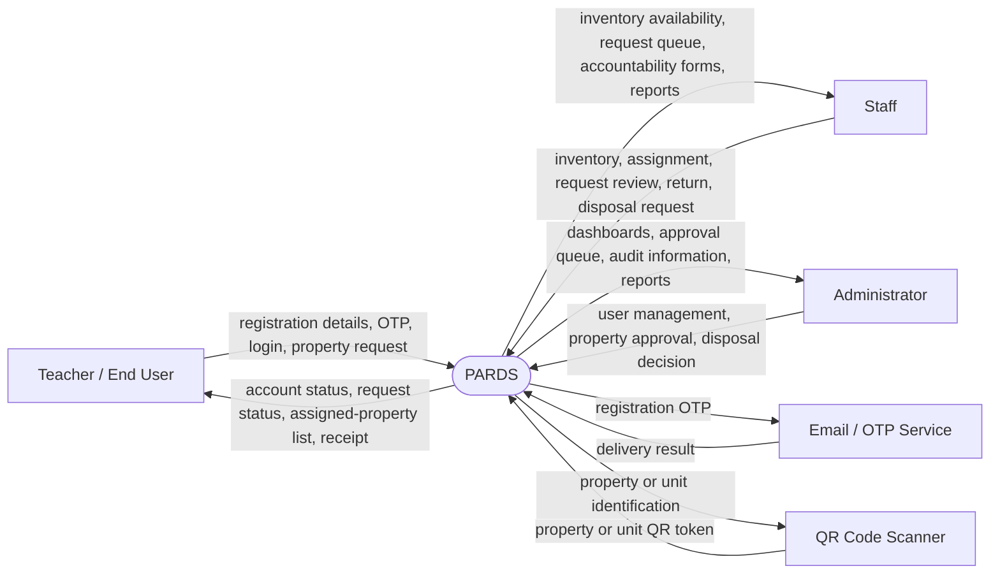
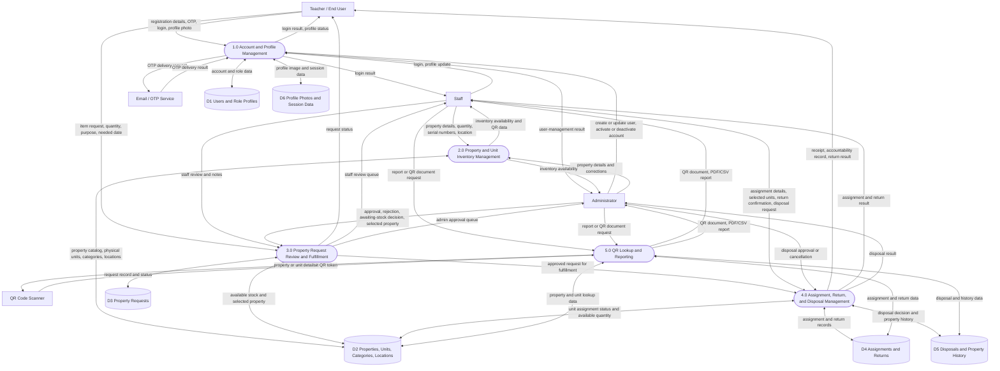
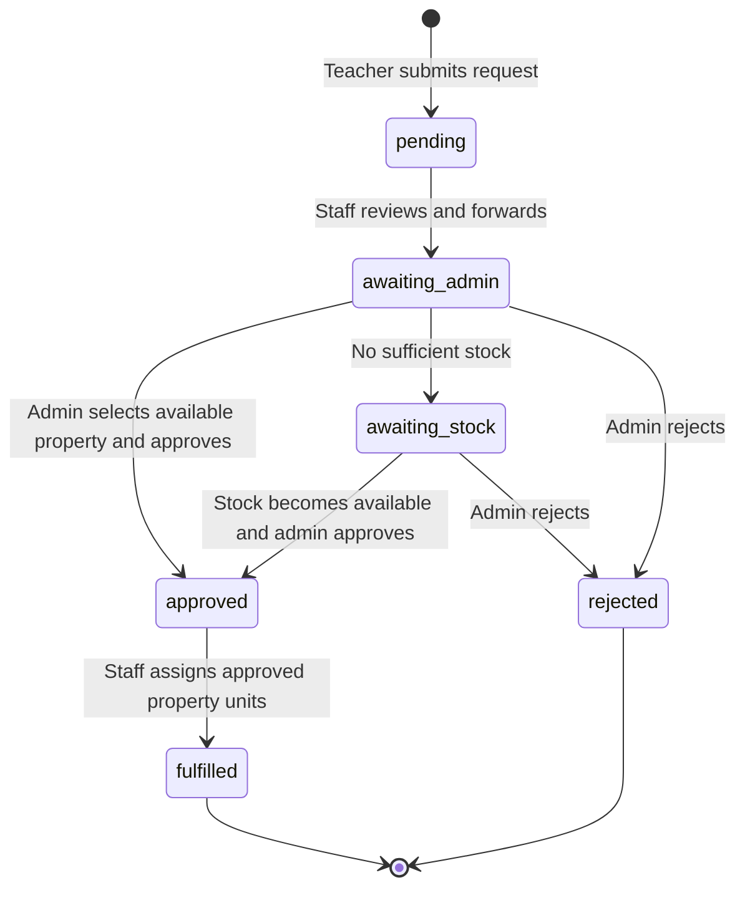

# PARDS Current System DFD — Level 0 and Level 1

These diagrams describe the implemented Property and Accountability Records and
Documentation System (PARDS). They follow the current routes, controllers,
services, and database schema. A rounded node is a process, a square node is
an external entity, and a cylinder is a persistent data store.

## Level 0 — Context Diagram

## Level 1 — Main Processes and Data Stores

## Process details

| Process | Responsibility | Main data stores |
| --- | --- | --- |
| 1.0 Account and Profile Management | Registers staff/teacher accounts through Gmail OTP, authenticates users, stores role profiles and profile photos, and lets admins manage user status. | D1, D6 |
| 2.0 Property and Unit Inventory Management | Creates and updates property records, generates one property-unit record per physical item, assigns distinct serial numbers and QR tokens, and keeps availability current. | D2 |
| 3.0 Property Request Review and Fulfillment | Records a teacher request; staff forwards it; admin approves, rejects, or marks it awaiting stock; then staff fulfills an approved request using the admin-selected property. | D2, D3, D4 |
| 4.0 Assignment, Return, and Disposal Management | Assigns available property units, produces accountability receipts, records returns, receives disposal requests, and applies the admin's disposal decision. | D2, D4, D5 |
| 5.0 QR Lookup and Reporting | Uses property/unit QR tokens for lookup and creates printable or downloadable property, assignment, and disposal reports. | D2, D4, D5 |

## Request status flow

Staff review sets the request status to `awaiting_admin`. The final fulfillment creates an assignment, links it to the property request,
marks the selected property units as assigned, and makes a printable receipt
available to the end user, staff, and administrator.
