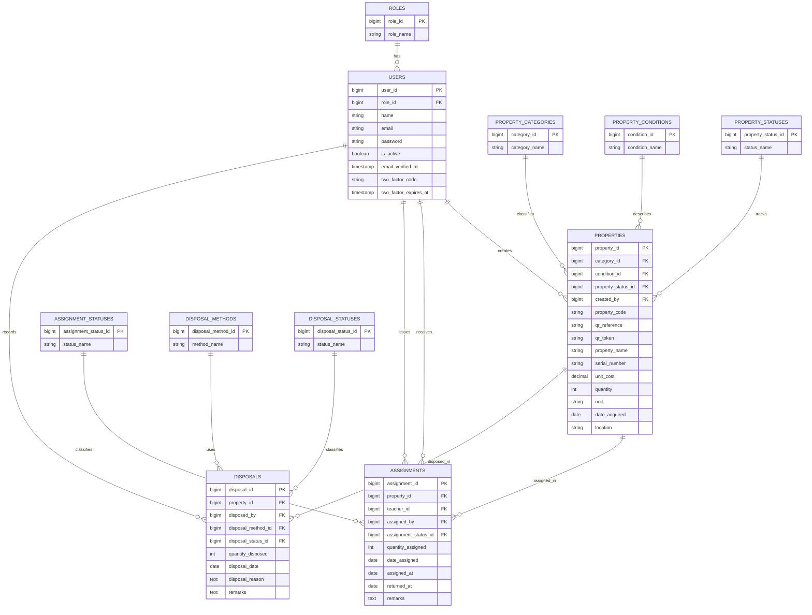

# Normalized ERD for PARDS

This ERD is based on your current PARDS project, but rewritten in a more normalized and easier-to-understand form.

The goal is:

- separate master data from transaction data
- avoid repeated values where possible
- keep relationships simple
- avoid circular or looping relationships

## Simple System Flow

To make the structure easy to follow, read it from top to bottom:

1. `roles` defines the kind of user.
2. `users` stores the people who use the system.
3. `properties` stores the items being tracked.
4. `assignments` records when a property is given to a teacher.
5. `disposals` records when a property is disposed.

The lookup tables only support those main records:

- `property_categories`
- `property_conditions`
- `property_statuses`
- `assignment_statuses`
- `disposal_methods`
- `disposal_statuses`

Because all child tables only point upward to parent tables, the ERD does not form a loop.

## Main Idea of the Design

- `users` is the main people table.
- `properties` belongs to the user who created the record.
- `assignments` connects one property to one teacher for a specific assignment event.
- `disposals` connects one property to one user for a specific disposal event.
- Status and classification values are moved to separate lookup tables for normalization.

## Core Entities Only

If you want the easiest version to explain in class, focus on these 4 main entities:

### `users`
Stores admins, staff, and teachers.

### `properties`
Stores all school properties or assets being tracked.

### `assignments`
Stores the history of property assignment to teachers.

### `disposals`
Stores the history of property disposal.

## Core Relationships Only

- One `user` can create many `properties`.
- One `property` can have many `assignments`.
- One teacher `user` can receive many `assignments`.
- One `user` can issue many `assignments`.
- One `property` can have many `disposals`.
- One `user` can record many `disposals`.

## Simple ERD Overview

```text
ROLES
  |
  v
USERS
  |
  +-------> PROPERTIES
              |
              +-------> ASSIGNMENTS <------- USERS (teacher / assigned by)
              |
              +-------> DISPOSALS  <------- USERS (disposed by)
```

This direction is intentional so there is no loop in the relationship structure.

## Main Entities

### 1. `roles`
- `role_id` (PK)
- `role_name`

### 2. `users`
- `user_id` (PK)
- `role_id` (FK -> `roles.role_id`)
- `name`
- `email`
- `password`
- `email_verified_at`
- `is_active`
- `two_factor_code`
- `two_factor_expires_at`
- `remember_token`
- `created_at`
- `updated_at`

### 3. `property_categories`
- `category_id` (PK)
- `category_name`

### 4. `property_conditions`
- `condition_id` (PK)
- `condition_name`

### 5. `property_statuses`
- `property_status_id` (PK)
- `status_name`

### 6. `properties`
- `property_id` (PK)
- `category_id` (FK -> `property_categories.category_id`)
- `condition_id` (FK -> `property_conditions.condition_id`)
- `property_status_id` (FK -> `property_statuses.property_status_id`)
- `created_by` (FK -> `users.user_id`)
- `property_code`
- `qr_reference`
- `qr_token`
- `property_name`
- `description`
- `brand`
- `model`
- `serial_number`
- `unit_cost`
- `quantity`
- `unit`
- `date_acquired`
- `location`
- `qr_code_path`
- `created_at`
- `updated_at`

### 7. `assignment_statuses`
- `assignment_status_id` (PK)
- `status_name`

### 8. `assignments`
- `assignment_id` (PK)
- `property_id` (FK -> `properties.property_id`)
- `teacher_id` (FK -> `users.user_id`)
- `assigned_by` (FK -> `users.user_id`)
- `assignment_status_id` (FK -> `assignment_statuses.assignment_status_id`)
- `quantity_assigned`
- `date_assigned`
- `assigned_at`
- `returned_at`
- `remarks`
- `created_at`
- `updated_at`

### 9. `disposal_methods`
- `disposal_method_id` (PK)
- `method_name`

### 10. `disposal_statuses`
- `disposal_status_id` (PK)
- `status_name`

### 11. `disposals`
- `disposal_id` (PK)
- `property_id` (FK -> `properties.property_id`)
- `disposed_by` (FK -> `users.user_id`)
- `disposal_method_id` (FK -> `disposal_methods.disposal_method_id`)
- `disposal_status_id` (FK -> `disposal_statuses.disposal_status_id`)
- `quantity_disposed`
- `disposal_date`
- `disposal_reason`
- `remarks`
- `created_at`
- `updated_at`

## Relationships

- One `role` can belong to many `users`.
- One `user` can create many `properties`.
- One `property_category` can classify many `properties`.
- One `property_condition` can describe many `properties`.
- One `property_status` can be used by many `properties`.
- One `property` can appear in many `assignments`.
- One `user` with teacher role can receive many `assignments`.
- One `user` with admin/staff role can issue many `assignments`.
- One `assignment_status` can classify many `assignments`.
- One `property` can appear in many `disposals`.
- One `user` can record many `disposals`.
- One `disposal_method` can be used by many `disposals`.
- One `disposal_status` can classify many `disposals`.

## Easy-to-Explain Relationship Summary

Here is the same relationship list in simple wording:

- A role can be assigned to many users.
- A user can encode many properties.
- A property belongs to one category, one condition, and one property status.
- A property can be assigned many times over time.
- A teacher can receive many assigned properties over time.
- A staff or admin user can process many assignments.
- A property can also have disposal records.
- A user can record many disposal transactions.

## Mermaid ERD



## Short Explanation Per Entity

### `roles`
This table stores the possible user roles such as admin, staff, and teacher.

### `users`
This table stores login and account information for people using the system.

### `property_categories`
This table stores the type of property, such as furniture, equipment, or device.

### `property_conditions`
This table stores the condition of the item, such as good or damaged.

### `property_statuses`
This table stores the current state of a property, such as available or assigned.

### `properties`
This is the main asset table. It stores each property item and its details.

### `assignment_statuses`
This table stores assignment states such as active or returned.

### `assignments`
This table records when a property is assigned to a teacher.

### `disposal_methods`
This table stores allowed disposal methods such as donation or recycling.

### `disposal_statuses`
This table stores the current progress of a disposal transaction.

### `disposals`
This table records when a property is marked for disposal or fully disposed.

## Normalization Notes

- `roles` is separated from `users` so role labels are not repeated row by row.
- Property classifications and statuses are separated into lookup tables to reduce update anomalies.
- Assignment and disposal statuses are separated so status values stay consistent.
- Disposal methods are separated so method names are controlled and reusable.
- Transaction tables (`assignments`, `disposals`) store only facts about each event and reference master tables through foreign keys.

## Mapping to Your Current Laravel Tables

Your current implementation already supports the same business flow, but these fields are still stored directly in the main tables:

- `users.role`
- `properties.category`
- `properties.condition_status`
- `properties.status`
- `assignments.status`
- `disposals.disposal_method`
- `disposals.status`

If you want, the next step can be either:

1. Keep this as the documentation ERD only.
2. Convert the Laravel schema to match this normalized ERD with new migrations.
