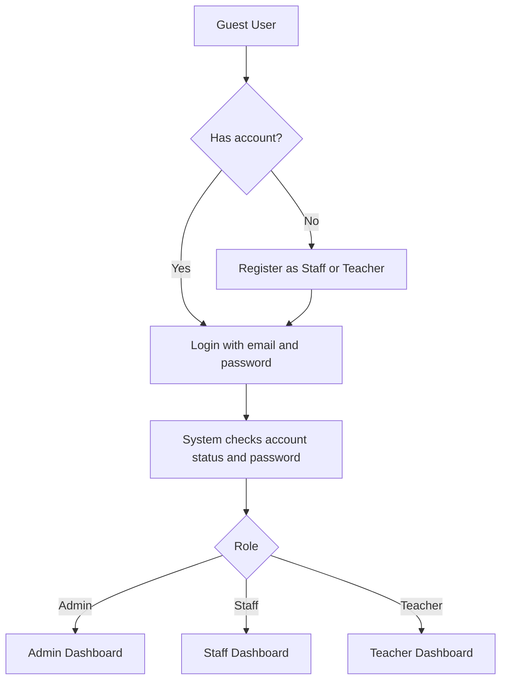
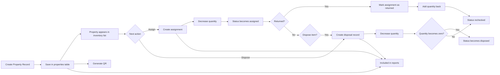

# PARDS System Flow

This document explains the actual flow of the current PARDS implementation in simple terms.

## 1. Main Users

- Admin
  Manages users and also has access to properties, assignments, disposals, QR codes, and reports.
- Staff
  Manages properties, assignments, disposals, QR codes, and reports.
- Teacher
  Read-only access to properties currently assigned to the logged-in teacher.

## 2. Login and Access Flow

### Actual login process

1. The user opens the login page.
2. The system checks if the account exists, if the password is correct, and if the account is active.
3. If the credentials are valid, the user is redirected based on role:
   - Admin -> Admin Dashboard
   - Staff -> Staff Dashboard
   - Teacher -> Teacher Dashboard
4. Registration for self-service accounts still requires a Gmail address.

## 3. Module Flow by Role

### Admin flow

1. Login with email and password.
2. Open Admin Dashboard.
3. Manage users:
   - create user
   - edit user
   - activate or deactivate user
   - delete user if there are no related assignment or disposal records
4. Access operations modules:
   - Property Management
   - Assignment Management
   - Disposal Management
   - QR Code Module
   - Reports

### Staff flow

1. Login with email and password.
2. Open Staff Dashboard.
3. Encode or update property records.
4. Assign property items to a teacher or staff member.
5. Record returned items.
6. Record disposal transactions.
7. Generate or download QR codes.
8. View or export reports.

### Teacher flow

1. Login with email and password.
2. Open Teacher Dashboard.
3. View only the active properties assigned to that teacher.
4. Open details of each assigned property.
5. Print the teacher's assigned property list.

## 4. Core System Process

### A. User management

1. Admin creates or updates user accounts.
2. Each user is assigned a role: `admin`, `staff`, or `teacher`.
3. The account can be activated or deactivated.
4. The role controls which modules are accessible after login.

### B. Property management

1. Admin or Staff opens the property form.
2. The system validates required fields like property name, property code, quantity, unit, condition, and status.
3. Property code must be unique.
4. QR token can be entered manually or auto-generated by the system.
5. After saving, the property is stored in the `properties` table.
6. The property becomes available for assignment, QR generation, and reports.

### C. Property assignment

1. Admin or Staff selects a property with available quantity.
2. The user chooses exactly one assignee:
   - teacher
   - staff member
3. The system checks if the requested quantity is not greater than the available quantity.
4. The assignment record is saved in the `assignments` table.
5. The system decreases the property quantity on hand.
6. The property status is re-evaluated and usually becomes `assigned` if there is an active assignment.

### D. Property return

1. Admin or Staff opens an active assignment.
2. The user records the return date.
3. The assignment status becomes `returned`.
4. The system adds the returned quantity back to the property.
5. The property status is checked again and may go back to `available`.

### E. Property disposal

1. Admin or Staff selects a property that is not yet fully disposed.
2. The system checks if the disposal quantity is within the available quantity.
3. The disposal record is saved in the `disposals` table.
4. The system decreases the property quantity on hand.
5. If the quantity reaches zero and there is a completed disposal record, the property status becomes `disposed`.

### F. QR code process

1. Admin or Staff opens the QR module for a property.
2. If the property has no QR token yet, the system creates one automatically.
3. The system generates a QR code containing:
   - property name
   - property code
   - current assignee
   - status
   - condition
   - location
   - public scan link
4. The QR code can be viewed or downloaded.
5. When scanned, the public QR page displays the current property details.

### G. Report generation

1. Admin or Staff opens the Reports module.
2. The system can generate:
   - Property List Report
   - Assigned Items Report
   - Disposal Report
3. Reports can be viewed on-screen.
4. Reports can also be exported as PDF or CSV.

## 5. End-to-End Property Lifecycle

## 6. Database Effect Per Process

- User management
  Writes to `users`
- Property creation or update
  Writes to `properties`
- Assignment
  Writes to `assignments` and decreases `properties.quantity`
- Return
  Updates `assignments` and increases `properties.quantity`
- Disposal
  Writes to `disposals` and decreases `properties.quantity`
- QR viewing
  Reads property and assignment data, and may generate `qr_token` if missing
- Reports
  Reads from `properties`, `assignments`, and `disposals`

## 7. Short Presentation Script

You can use this in your defense or demo:

"Ang flow ng aming PARDS system ay nagsisimula sa user authentication. Magla-login ang user gamit ang email at password, at kapag tama ang credentials at active ang account, iri-redirect ang user base sa role niya bilang Admin, Staff, o Teacher. Ang registration ng Staff at Teacher accounts ay nangangailangan ng Gmail address. Ang Admin ay para sa user management at may access din sa operational modules, habang ang Staff ay nakatuon sa property encoding, assignment, disposal, QR generation, at reports. Kapag gumawa ng property record, mase-save ito sa inventory. Kapag may in-assign na item, gagawa ang system ng assignment record at mababawasan ang available quantity. Kapag naibalik ang item, madadagdag ulit ang quantity. Kapag hindi na magagamit ang item, irerecord ito sa disposal module at ia-update ang property status. Ang Teacher ay view-only at makikita lang ang mga property na naka-assign sa kanya. Sa dulo, puwedeng gumamit ng QR at reports para sa mabilis na tracking at formal documentation."

## 8. Source of This Flow

This flow was based on the current implementation in:

- `routes/web.php`
- `app/Http/Controllers/Auth/AuthenticatedSessionController.php`
- `app/Http/Controllers/UserController.php`
- `app/Http/Controllers/PropertyController.php`
- `app/Http/Controllers/AssignmentController.php`
- `app/Http/Controllers/DisposalController.php`
- `app/Http/Controllers/QrCodeController.php`
- `app/Http/Controllers/ReportController.php`
- `app/Http/Controllers/Teacher/TeacherPropertyController.php`
